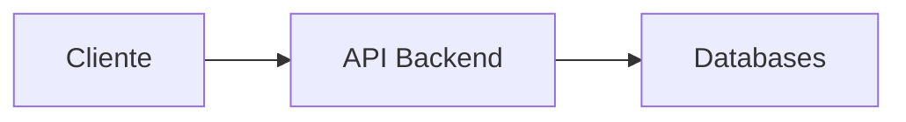

# 🚀 TechChallenge-Grupo13
Aplicação para todo sistema de Controle de Pedidos de uma lanchonete - [API] Backend (monolito).


## 🖥️ Grupo 13 - Integrantes
🧑🏻‍💻 *<b>RM352133</b>*: Eduardo de Jesus Coruja </br>
🧑🏻‍💻 *<b>RM352316</b>*: Eraldo Antonio Rodrigues </br>
🧑🏻‍💻 *<b>RM352032</b>*: Luís Felipe Amengual Tatsch </br>

</br>

## 🔗 Links do projeto
- Documento: [DDD](https://1drv.ms/w/s!AntPAkrc0xN9q8kH5tUnZYZQgotMxQ?e=f4ur3f)
- Miro: [Dashboard Miro](https://miro.com/app/board/uXjVNVsDxDM=/?share_link_id=908610551369)
- GIT: [Repositório GIT](https://github.com/eraldoads/TechChallenge-Grupo13)
- Documentação API: [Swagger](http://localhost/swagger/index.html)
- Testes: [Postman](https://www.postman.com/martian-resonance-699333/workspace/grupo-13-tech-challenge-fase-i/collection/13215309-ff36e055-fccf-48db-9965-b76e4ace4e93?tab=overview)

</br>

## ☑️ Criação do ambiente para testes
Realize o download do projeto TechChallenge-Grupo13.
</br></br>
Acesse o site https://webhook.site/ e copie a url para teste do webhook.
</br></br>
Altere o valor da variável <b>WEBHOOK_ENDPOINT</b> dentro do arquivo <b>piklesfastfood-configmap.yaml</b> para a url copiada do site. Este arquivo está localizado na pasta <b>TechChallenge-Grupo13\kubernetes</b>.
</br></br>
Execute o Docker Engine.
</br></br>
Abra um terminal e execute o comando abaixo para iniciar o minikube:
</br>
```
minikube start
```
</br>

Em seguida, execute o comando abaixo para habilitar a coleta de métricas no cluster:
</br>
```
minikube addons enable metrics-server
```
</br>

Ainda no terminal, acesse a pasta <b>TechChallenge-Grupo13\kubernetes</b> e execute os comandos a seguir:
</br>

```
kubectl apply -f mysql-configmap.yaml
kubectl apply -f mysql-pv.yaml
kubectl apply -f mysql-pvc.yaml
kubectl apply -f mysql-secrets.yaml
kubectl apply -f mysql-service.yaml
kubectl apply -f mysql-statefulset.yaml
kubectl apply -f piklesfastfood-configmap.yaml
kubectl apply -f piklesfastfood-deployment.yaml
kubectl apply -f piklesfastfood-hpa.yaml
kubectl apply -f piklesfastfood-secrets.yaml
kubectl apply -f piklesfastfood-service.yaml
kubectl apply -f adminer-deployment.yaml
kubectl apply -f adminer-service.yaml
```
</br>
Execute o comando abaixo para expor a API na porta 8080:
</br></br>

```
kubectl port-forward svc/piklesfastfood 8080:80
```
</br>

Acesse a documentação da API:
http://localhost:8080/swagger/index.html


Abra outro terminal e execute o comando abaixo para expor o Adminer na porta 8090:
```
kubectl port-forward svc/adminer 8090:8080
```
</br>

Acesse o Adminer no browser: 
http://localhost:8090/


Utilize as seguintes credenciais:

```
Servidor: mysql
Usuário: pikles
Senha: fastfood
Base de Dados: piklesfastfood
```


Para criar as tabelas e inserir uma massa de dados no banco Mysql, importe o arquivo <b>init.sql</b> localizado na pasta <b>PIKLESFASTFOOD</b> e clique no botão <b>Executar</b>:
</br></br>


</br>

Abra um terminal e execute o comando a seguir para visualizar os recursos criados no ambiente Kubernetes:

```
minikube dashboard
```

Será exibida a url para acessar o dashboard com o ambiente Kubernetes:


</br>

Para testar os endpoints da API via Postman, você deverá importar o json da collection e do enviroment, os quais estão disponíveis na pasta <b>Postman</b> dentro do projeto:


</br>
</br>

</br>
</br>

Após seguir todos os passos anteriores, o ambiente estará pronto para os testes.

## ☑️ Testes
Criação do pedido
Criação do pagamento

Opcional:
Obter QRCODE
Acessar site https://www.qrcode-monkey.com/ e gerar a imagem a partir do QRCODE obtido
Realizar o pagamento via Mercado Pago
Obter o id da merchant_order
Realizar o request para o endpoint webhook passando o id por parâmetro

Relizar o request do endpoint para obter o status do pedido
Realizar o request para o endpoint de atualização do status do pedido

## 🔗 Tecnologias


</br>

## 🔛 Fluxo:


