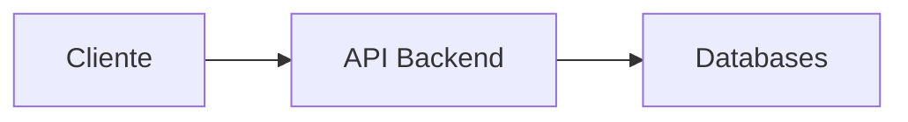

# 🚀 TechChallenge-Grupo13
Aplicação para todo sistema de Controle de Pedidos de uma lanchonete - [API] Backend (monolito).

 

## 🖥️ Grupo 13 - Integrantes
🧑🏻‍💻 *<b>RM352133</b>*: Eduardo de Jesus Coruja  
🧑🏻‍💻 *<b>RM352316</b>*: Eraldo Antonio Rodrigues  
🧑🏻‍💻 *<b>RM352032</b>*: Luís Felipe Amengual Tatsch  

 

## 🔗 Links do projeto
- Documento: [DDD](https://1drv.ms/w/s!AntPAkrc0xN9q8kH5tUnZYZQgotMxQ?e=f4ur3f)
- Miro: [Dashboard Miro](https://miro.com/app/board/uXjVNftHwCM=/)
- GIT: [Repositório GIT](https://github.com/eraldoads/TechChallenge-Grupo13)
- Documentação API: [Swagger](https://www.xxxx.com)
- Testes: [Postman](https://www.xxxx.com)

 

## 🔗 Tecnologias

 

## 🔗 Testes

Para executar esta solução, basta rodar o comando <b>docker-compose up</b> dentro da pasta <b>PIKLES-FASTFOOD</b>.

Serão criados os containeres da API e do Banco de Dados MySQL.
Também será criado um container para uma interface de admin do banco, onde será possível visualizar as tabelas criadas.

Como acessar:
API: http://localhost/swagger/index.html
Interface admin Mysql: http://localhost:8080/

 

## 🔛 Fluxo:

