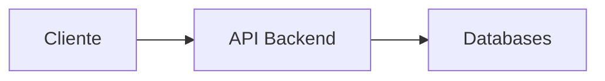

# 🚀 TechChallenge-Grupo13
Aplicação para todo sistema de Controle de Pedidos de uma lanchonete - [API] Backend (monolito).

</br>

## 🖥️ Grupo 13 - Integrantes
🧑🏻‍💻 *<b>RM352133</b>*: Eduardo de Jesus Coruja </br>
🧑🏻‍💻 *<b>RM352316</b>*: Eraldo Antonio Rodrigues </br>
🧑🏻‍💻 *<b>RM352032</b>*: Luís Felipe Amengual Tatsch </br>

</br>

## 🔗 Links do projeto
- Documento: [DDD](https://1drv.ms/w/s!AntPAkrc0xN9q8kH5tUnZYZQgotMxQ?e=f4ur3f)
- Miro: [Dashboard Miro](https://miro.com/app/board/uXjVNftHwCM=/)
- GIT: [Repositório GIT](https://github.com/eraldoads/TechChallenge-Grupo13)
- Documentação API: [Swagger](http://localhost/swagger/index.html)
- Testes: [Postman](https://www.postman.com/martian-resonance-699333/workspace/grupo-13-tech-challenge-fase-i/collection/13215309-ff36e055-fccf-48db-9965-b76e4ace4e93?tab=overview)

</br>

## ☑️ Testes

Para executar esta solução, você deve entrar na pasta <b>PIKLES-FASTFOOD</b> e executar o comando:
```
docker-compose up
```
Esse comando irá ler o arquivo <b>docker-compose.yml</b> que está na mesma pasta e criar os containers da API e do Banco de Dados MySQL.
</br>
</br>
Além disso, será criado um container para uma interface de administração do banco, onde você poderá visualizar as tabelas criadas.
</br>
</br>
Depois da criação do banco, serão executados os comandos definidos no arquivo <b>init.sql</b>, que contém a criação das tabelas e os inserts para gerar uma massa de dados para os testes.

</br>
<b>Como acessar</b>:
</br>

<b>API</b>: http://localhost/swagger/index.html
</br>
<b>Interface admin MySQL</b>: http://localhost:8080/
</br>
</br>
```
Servidor: db
Usuário: pikles
Senha: fastfood
Base de Dados: piklesfastfood
```


</br>

<b>⚠️ Atenção:</b> A documentação estará disponível somente depois de executar a solução. Para acessar a documentação do SWAGGER, clique na imagem abaixo:

[](https://www.postman.com/martian-resonance-699333/workspace/grupo-13-tech-challenge-fase-i/collection/13215309-ff36e055-fccf-48db-9965-b76e4ace4e93?tab=overview)


Para testar os endpoints da API, você pode usar a collection do POSTMAN, disponível no endereço público, clicando na imagem abaixo:

[](https://www.postman.com/martian-resonance-699333/workspace/grupo-13-tech-challenge-fase-i/collection/13215309-ff36e055-fccf-48db-9965-b76e4ace4e93?tab=overview)


</br>

## 🔗 Tecnologias


</br>

## 🔛 Fluxo:

